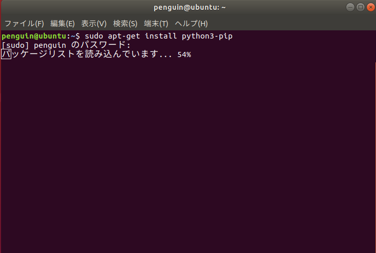

# TensorFlowで画像認識を行うための環境構築の方法
## Windows10(Anaconda使用・不使用)とUbuntuの環境構築について
***
## Windows10の場合(Anaconda環境使用)
- Anacondaのダウンロード。

	<a href="https://www.anaconda.com/" target="_blank">Anacondaのサイト</a>から、Anacondaをダウンロードする。
	

- Pathを通してAnacondaのインストール。

	インストール画面で、Pathを追加するにチェックを入れる。
	
- Anaconda環境でPythonの実行をしてみる。

	AnacondaNavigatorメニューのJupiterNotebookのLaunchをクリックして、JupiterNotebookを起動させる。
	
	既定のブラウザが起動するので、好きな場所に移動して、NewからPython3を選択する。

	
	JupiterNotebookの入力ウィンドウに`print("Hello")`と入力してRunのボタンをクリックするか、Ctrl+EnterでPythonを実行させ、コンソールに`Hello`と表示されることを確認する。

	
- Anaconda上でTensorFlowの環境を作る。

	environmentsのCreateをクリックしてTensorFlowの環境を作る。
	
- TensorFlowのターミナルを起動させる

	上記で作ったTensorFlow環境を起動させる。▶マークをクリックして`Open Terminal`をクリックする。
	
- TensorFlowのインストール。

	TensorFlowをインストールする。α版を使う場合、バージョンを指定する。
	```
	pip install tensorflow
	```
	
- TensorFlow Hunのインストール。

	TensorFlow Hubをインストールする。
	```
	install tensorflow-hub
	```
	
- エンペラーペンギンの画像を使ってチェック。

	エンペラーペンギンの画像を使って、TensorFlow、TensorFlow Hubが正常にインストール出来たかを確認する。
	

	実行するPythonファイルと使用する画像、学習データ、ラベルがあるディレクトリに移動して画像認識を行うコマンドを入力する。
	```
	python penguin.py --graph output_graph.pb --labels penguin_list.txt --input_layer Placeholder --output_layer final_result --image emp.jpg
	```
	ペンギンの種類が表示されたら成功。
	
***
***
## Windows10の場合(Anaconda環境不使用)
- Pythonのダウンロード。

	<a href="https://www.python.org/" target="_blank">Pythonの公式サイト</a>から、Pythonをダウンロードする。
	
- Pathを通してPythonをインストール。

	インストール画面でPathを追加するにチェックを入れる。
	
- Pythonが正常にインストールされたかの確認

	コマンドプロンプトで`python`と入力してPythonが起動することを確認する。起動できない場合、Pathが通っているか確認する。
	
- pipのアップデート ※必要に応じて

	pipのアップデートを行う。
	```
	pip install -U pip
	```
	
- TensorFlowのインストール

	TensorFlowをインストールする。α版を使う場合、バージョンを指定する。
	```
	pip install tensorflow
	```
	
- TensorFlow Hubのインストール。

	TensorFlow Hubをインストールする。
	```
	install tensorflow-hub
	```
	
- エンペラーペンギンの画像を使ってチェック。

	エンペラーペンギンの画像を使って、TensorFlow、TensorFlow Hubが正常にインストール出来たかを確認する。
	

	実行するPythonファイルと使用する画像、学習データ、ラベルがあるディレクトリに移動して画像認識を行うコマンドを入力する。
	```
	python penguin.py --graph output_graph.pb --labels penguin_list.txt --input_layer Placeholder --output_layer final_result --image emp.jpg
	```
	ペンギンの種類が表示されたら成功。
	
***
***
## Ubuntuの場合(Anaconda環境不使用)
### ※Ubuntu 18.04.2 LTS 日本語Remixを使用。
- Python3のPipをインストール。

	Python3のPipがインストールされていなかったので、Python3のPipをインストールする。
	```
	sudo apt-get install python3-pip
	```
	
- TensorFlowをインストール。

	Python3のpipを使ってTensorFlowのインストール。
	```
	python3 -m pip install tensorflow
	```
	
- TensorFlow Hubをインストール。

	Python3のpipを使ってTensorFlow Hubのインストール。
	```
	python3 -m pip install tensorflow-hub
	```
	
- エンペラーペンギンの画像を使ってチェック。

	エンペラーペンギンの画像を使って、TensorFlow、TensorFlow Hubが正常にインストール出来たかを確認する。
	

	実行するPythonファイルと使用する画像、学習データ、ラベルがあるディレクトリに移動して画像認識を行うコマンドを入力する。
	```
	python3 penguin.py --graph output_graph.pb --labels penguin_list.txt --input_layer Placeholder --output_layer final_result --image emp.jpg
	```
	※Python3のバージョンを指定して実行する。

	ペンギンの種類が表示されたら成功。
	
***
